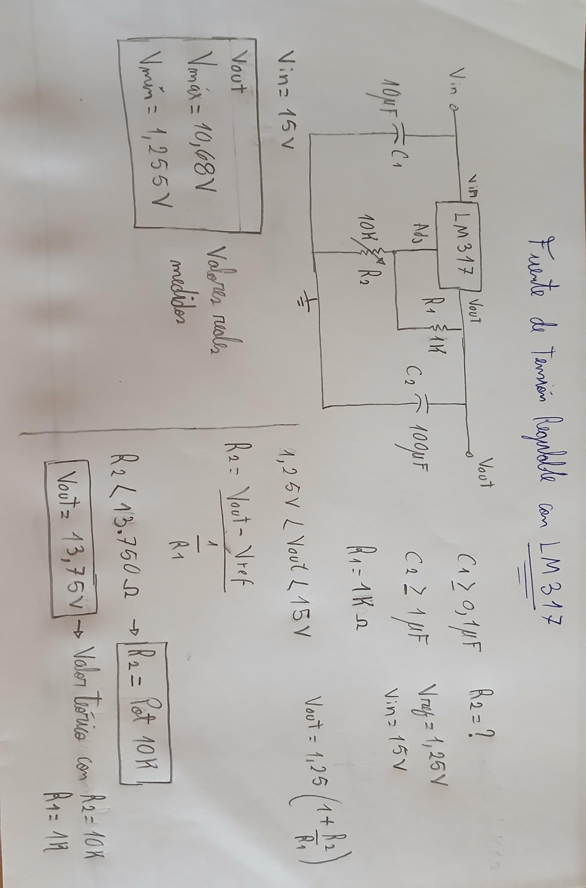
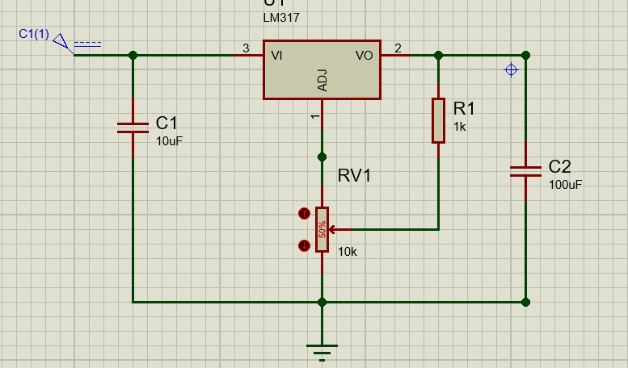
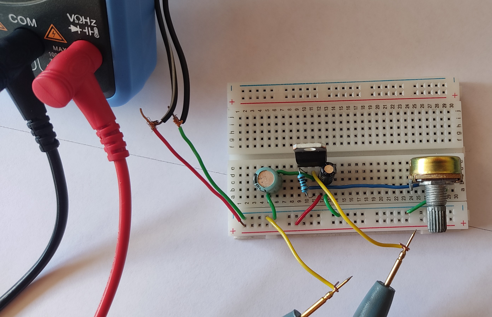

# Fuente-de-Voltaje-Regulable-con-LM317
Fuente de tensión regulable de 1.25V a 10V utilizando el regulador de voltaje LM317. Con el potenciómetro se puede regular la tensión.

- **Voltaje de entrada:** 15V

- **Voltaje de salida**: $Vout = 1.25*(1+R2/R1)$

- **Rango con R1 = 1K y R2 = 10K:** 
  - **Mínimo teórico:** 1.25V (Vref) cuando R2 = 0  
  - **Máximo teórico:** 13.75V

  - **Mínimo medido:** 1.255V
  - **Máximo medido:** 10.68V

Se obtuvo un voltaje de salida máximo de 10.68V y un voltaje mínimo de 
1.255V. 
El voltaje máximo medido fue menor al teórico debido a la caída de voltaje mínima (dropout voltage) del LM317 olerancias, así como posibles limitaciones de la fuente de entrada.

🎬 **Demostración: [Video](https://youtu.be/LkwJNtBGrnM)**

## ⚡ Componentes
- LM317
- Resistencia de 1K
- Potenciómetro de 10K
- Capacitor de 10uF
- Capacitor de 100uF
- Protoboard
- Cables
- Fuente de 15V

## Diseño

## 📐 Esquemático

## 🔌 Montaje

